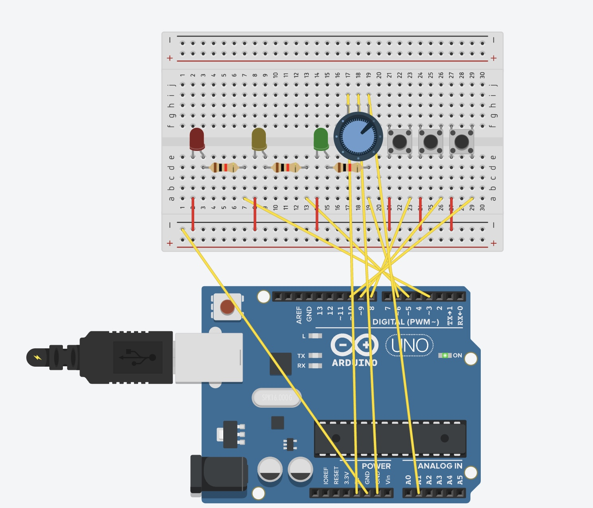

# Arduino Traffic Light & Gesture Control

> 아두이노와 p5.js를 이용하여 신호등을 제어하고, ml5.handpose로 웹캠 제스처 인식을 구현한 프로젝트

---

## 목차

1. [프로젝트 개요](#프로젝트-개요)
2. [구현 기능](#구현-기능)
3. [하드웨어 구성](#하드웨어-구성)
4. [소프트웨어 구성](#소프트웨어-구성)
5. [설치 및 실행](#설치-및-실행)
6. [파일 구조](#파일-구조)

---

## 프로젝트 개요

이 프로젝트는 **아두이노**에서 LED 신호등을 제어하고, **p5.js + ml5.js(handpose)**를 통해 **웹캠에서 손 제스처**를 인식하여:

- **왼손**: 신호등 주기(빨강/노랑/초록 시간) 조절  
- **오른손**: 모드 전환 (OFF, Normal, Emergency, Blink)

등을 **직관적으로** 제어하기 위해 만들어졌습니다.

[동영상 보러가기](https://www.youtube.com/watch?v=영상ID)


---

## 구현 기능

1. **아두이노 신호등**  
   - 빨강/노랑/초록 LED와 TaskScheduler를 이용한 자동 사이클  
   - Potentiometer(가변저항)로 LED 밝기 조절  
   - 시리얼로 들어온 `MODE:...`, `"{red},{yellow},{green}"` 명령을 받아 동적으로 모드 전환 및 주기 변경

2. **p5.js 제스처 인식**  
   - ml5.handpose 모델로 웹캠 실시간 추적  
   - **왼손**: 검지를 특정 방향(위/아래)으로 유지하면 빨간 LED 주기를 0.5초마다 +100/-100ms (등등 로직 정의 가능)  
   - **오른손**: V사인(Blink), 주먹(Emergency), 손바닥 펴짐(Normal), 등등 모드 전환  
   - 슬라이더 UI로도 직접 시간 변경 가능


| 제스처 이름 | 이미지 |
|-------------|--------|
| 오른손 엄지만 핌(normal mode) |  |
| 오른손 엄지+검지(blink mode) |  |
| 오른손 엄지+검지+중지(emergency mode) |  |
| 오른손 약지만 굽힘(off) |  |
| 왼손 엄지만 핌(red +) |  |
| 왼손 엄지+검지(red -) |  |
| 왼손 엄지+새끼(yellow +) |  |
| 왼손 엄지+약지+새끼(yellow -) |  |
| 왼손 모두 핌(green +) |  |
| 왼손 중지만 굽힘(green -) |  |

3. **Web Serial API**  
   - 브라우저에서 **시리얼 포트**를 선택, 아두이노와 양방향 통신  
   - `p5.js`가 명령 문자열을 `writer.write(...)`로 전송  
   - 아두이노 `processSerialData()`에서 수신

---

## 하드웨어 구성

- **Arduino** (Uno)
- **LED 3개** (빨강, 노랑, 초록) + 저항
- **Potentiometer** (밝기 조절)
- **버튼 3개** (모드 변환용)
- 브레드보드, 점퍼 케이블 등

| 핀  | 연결              |
|-----|-------------------|
| D3  | 빨간 LED (PWM)    |
| D5  | 노랑 LED (PWM)    |
| D6  | 초록 LED (PWM)    |
| A1  | 가변저항          |
| 8   | 버튼 1 (Red Mode) |
| 9   | 버튼 2 (BlinkAll) |
| 10  | 버튼 3 (Toggle)   |




---

## 소프트웨어 구성

1. **Arduino 측**  
   - `ArduinoTrafficLight.ino` (TaskScheduler, PinChangeInterrupt 사용)  
   - 빌드/업로드: VSCode platformio Extension

2. **p5.js 측**  
   - `index.html`: 로드할 스크립트(p5.js, ml5.min.js, sketch.js 등)  
   - `sketch.js`: 제스처 인식, Web Serial, 슬라이더 UI, 밝기와 신호 인디케이터
   - 의존 라이브러리: [p5.js 1.4.0+](https://p5js.org/), [ml5.js(handpose)](https://learn.ml5js.org/#/reference/handpose)

3. **통신**  
   - Web Serial API  
   - `9600 baudRate` (아두이노에서 Serial.begin(9600))

---

## 설치 및 실행

1. **하드웨어 연결**  
   - LED, 버튼, 가변저항 핀 배치 (위 표 참고)
   - 아두이노에 USB 케이블 연결

2. **아두이노 코드 업로드**  
   ```bash
   # Arduino IDE 열기
   # ArduinoTrafficLight.ino 오픈
   # 보드/포트 설정 → 업로드

---

## 파일 구조

my-traffic-light-project/
├── Arduino/
│   └── ArduinoTrafficLight.ino
├── web/
│   ├── index.html
│   ├── sketch.js
│   ├── p5.min.js
│   └── ml5.min.js
├── README.md
└── LICENSE

